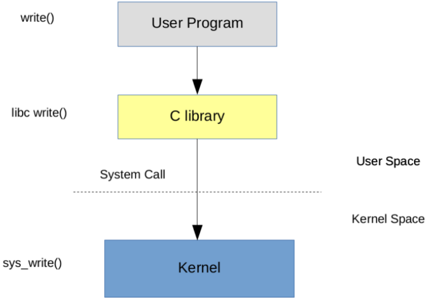

<!-- theme: gaia -->
<!-- _class: lead -->

## Lecture 1 Operating System Overview

### Section 5 Practice: Try UNIX/Linux

 
 

Yong Xiang, Yu Chen, Guoliang Li, Ju Ren

 
 

Spring 2023

---
## UNIX/Linux?

- Linux
    - Ubuntu, Fedora, SuSE, openEuler
    - Kylin OS(麒麟), Unity OS(统信)
- Windows with WSL (Windows Subsystem of Linux)
- MacOS with UNIX shell
---
## Why Linux?
- Open source, sufficient documents, concise design, widely used
- It will be helpful for learning ucore and rcore if you know the design details of Linux.

---
## Try Linux

- shell
    - bash, fish, zsh, starship...

- program
    - ls, rm, gcc, gdb, vim...

---
## What services does the Linux kernel usually provide?

   * Process (a running program)
   * Memory allocation
   * Document content
   * File name, directory
   * Access Control (Security)
   * Many others: user, IPC, network, time

---

## The application/kernel interface provided by the Linux kernel?

   - "System call"
   - Examples, in C, from UNIX (e.g. Linux, macOS, FreeBSD).

             fd = open("out", 1);
             write(fd, "hello\n", 6);
             pid = fork()

  - These look like function calls, but they are not
  - The number of core system calls is not large (about 20)

---
## The application/kernel interface provided by the Linux kernel?

| System call name | Meaning |
| ------------------------ | ---- |
| ``int fork()`` | Create a process, return child's PID. |
| ``int exit(int status)`` | Terminate the current process; status reported to wait(). No return. |
| ``int wait(int *status)`` | Wait for a child to exit; exit status in *status; returns child PID. |
| ``int kill (int pid)`` | Terminate process PID. Returns 0 for success, or -1 for error. |
| ``int getpid()`` | Return the current process's PID. |

---
## The application/kernel interface provided by the Linux kernel?

| System call name | Meaning |
| ------------------------ | ---- |
| ``int sleep(int n)`` | Pause for n clock ticks. |
| ``int exec(char *file, char *argv[])`` | Load a file and execute it with arguments; only returns if error. |
| ``char *sbrk(int n)`` | Grow process's memory by n bytes. Returns start of new memory. |
| ``int open(char *file, int flags)`` | Open a file; flags indicate read/write; returns an fd (file descriptor). |
| ``int write(int fd, char *buf, int n)`` | Write n bytes from buf to file descriptor fd; returns n. |

---
## The application/kernel interface provided by the Linux kernel?

| System call name | Meaning |
| ------------------------ | ---- |
| ``int read(int fd, char *buf, int n)`` | Read n bytes into buf; returns number read; or 0 if end of file. |
| ``int close(int fd)`` | Release open file fd. |
| ``int dup(int fd)`` | Return a new file descriptor referring to the same file as fd.|
| ``int pipe(int p[])`` | Create a pipe, put read/write file descriptors in p[0] and p[1]. |
| ``int chdir(char *dir)`` | Change the current directory. |

---
## The application/kernel interface provided by the Linux kernel?

| System call name | Meaning |
| ------------------------ | ---- |
| ``int mkdir(char *dir) `` | Create a new directory. |
| ``int mknod(char *file, int, int)`` | Create a device file. |
| ``int fstat(int fd, struct stat *st)`` | Place info about an open file into *st. |
| ``int stat(char *file, struct stat *st)`` | Place info about a named file into *st. |
| ``int link(char *file1, char *file2)`` | Create another name (file2) for the file file1. |
| ``int unlink(char *file)`` | Remove a file. |

---
## Some UNIX/Linux applications

[Some simple programs](https://pdos.csail.mit.edu/6.828/2021/lec/l-overview/)

#### Process related

fork.c exec.c forkexec.c ...
#### File system related
list.c open.c echo.c copy.c ...
#### Inter-process communication related
  pipe1.c pipe2.c redirect.c ...

---
## Some UNIX/Linux applications

Example: [open.c](https://pdos.csail.mit.edu/6.828/2021/lec/l-overview/open.c), create a file

     $ open
     $ cat output.txt

open() creates a file, and returns a file descriptor FD (or -1 for errors). FD is a small integer, and indexed into a table maintained by the kernel for each process.

Different processes have different FD namespaces. Further details can be found in UNIX manuals, e.g., using "man 2 open". The first parameter of "man": 1 for shell commands, 2 for syscall.

---
## Some UNIX/Linux applications
  Example: [copy.c](https://pdos.csail.mit.edu/6.828/2021/lec/l-overview/copy.c), copy input to output
It reads bytes from input, and writes them to output

         $ copy
    
   read() and write() are system calls
   The first parameter of read()/write() is "file descriptor" (FD), which is passed to the kernel and indicates which "open file" to read/write.

---
## Some UNIX/Linux applications

An opened FD (descriptor) should be connected to a file/device/socket.
A process can have many opened files with many descriptors. 

In UNIX, FD: 0 is usually "standard input", and 1 is "standard output"

The second parameter of read() is a pointer to the data buffer to be read.

The third parameter of read() is the maximum number of bytes to read.
Note: read() can read less, but not more

File access mode: open -> read/write -> close

<!--eg "man 2 open".
man 1 is a shell command such as ls; man 2 is a system call such as open; man 3 is a function description-->

---

## Some UNIX/Linux applications
The system call fork() creates a new process

     $ fork

The kernel creates a copy of the calling process
- Instructions, data, registers, file descriptors, current directory
- "parent" and "child" processes

---

## Some UNIX/Linux applications

The only difference: fork() returns the pid of child process in the parent process and 0 in the child process.

pid (process ID) is an integer, the kernel assigns a different pid for each process.

Therefore, the "fork() returns" of [fork.c](https://pdos.csail.mit.edu/6.828/2021/lec/l-overview/fork.c) in **two** processes can be used for distinguishing the parent and child processes by using "if(pid == 0)".

---
## Some UNIX/Linux applications

How can we run a new program in this process?

Example: [exec.c](https://pdos.csail.mit.edu/6.828/2021/lec/l-overview/exec.c), replace the calling process with an executable file.

exec(filename, argument-array)
argument-array stores the command line arguments and passes to main() by exec.

---
## Some UNIX/Linux applications

exec() replaces the current process with an executable file
- Discard the instruction and data memory
- Load instructions and memory from the file
- By default, file descriptors are preserved

---
## Some UNIX/Linux applications

Example: [forkexec.c](https://pdos.csail.mit.edu/6.828/2021/lec/l-overview/forkexec.c), fork() a new process, exec() a program.

       $ forkexec

How to run a new program?
- fork(): fork a child process
- exec(): execute a new program in a child process
- wait(): the parent process waits for the child process to complete
- exit(): the child process exits

---
## Some UNIX/Linux applications

Example: [redirect.c](https://pdos.csail.mit.edu/6.828/2021/lec/l-overview/redirect.c), redirect the output of a command

- By default, FD=1 means the standard output (screen)
- open() always uses the minimum unused FD
- Set the FD of "output.txt" as 1 by using close(1) + open(...)
- exec() reserves the FDs, the ouput will be redirected to "output.txt" by executing "echo"

       $ redirect
       $ cat output.txt
     

---

## Some UNIX/Linux applications

Example: [pipe2.c](https://pdos.csail.mit.edu/6.828/2021/lec/l-overview/pipe2.c), communicates between processes.     

An FD can refer to either a "pipe" or a file.

The system call pipe() creates two FDs：
- read from the first FD
- write to the second FD

      $ ls | grep x

---
## Some UNIX/Linux applications

Some questions:
- Why these I/O and process abstractions? Why not something else?
- Why provide a filesystem? Why not let programs use the disk in their own way?
- Why FDs? Why not pass a filename to write()?
- Why are files a stream of bytes, not disk blocks or formatted records?
- Why not combine fork() and exec()?

The design of UNIX works well, but we'll see other designs.

---
## Summary

   - We have studied UNIX's abstractions of I/O, file system and process.
   - These interfaces are very simple, only with integers and I/O buffers.
   - These abstractions combine well, for example, I/O redirection.

## Practice

- [rCore-Tutorial-Book-v3 第零章--练习](http://rcore-os.cn/rCore-Tutorial-Book-v3/chapter0/7exercise.html#)
- understand and run [the examples](https://pdos.csail.mit.edu/6.828/2021/lec/l-overview/)
