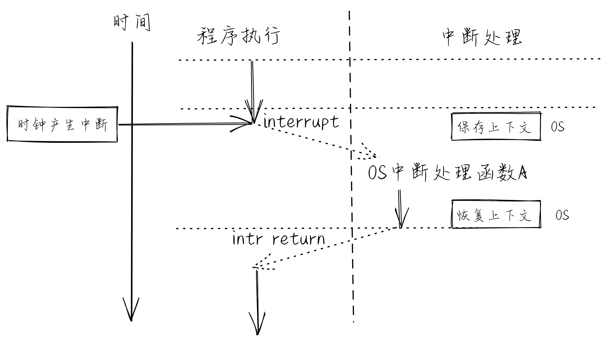

<!-- theme: gaia -->
<!-- _class: lead -->

# Lecture 3 Privilege based Isolation and Batch Processing
## Section 1 Computer System: An OS's Perspective
<!-- CSAPP style-->
 
 

Xiang Yong, Chen Yu, Li Guoliang, Ren Ju

 
 

Spring 2023

---
**Outline**

### **1. The relationship between OS and hardware**
### 2. The relationship between OS and applications
### 3. Isolation mechanism

---

#### Computer System

Computer architecture is the **design of the abstraction layers** that allow us to implement information processing applications efficiently using available manufacturing technologies.
 
-- cs-152 berkeley
 <!--Here I just find original sentences from UCB CS-152 slide-->

---
#### Abstraction Levels of Computer System

**HARDWARE** SUPPORTS **OS**, and OS SUPPORTS **APPLICATIONS**

* OS is located between the hardware (HW) and applications (APP)
* Understanding the relationship between OS and HW/APP can help you better master OS

---
#### Instruction Set Architecture(ISA): hardware and software interface
**Boundary** between **hardware** and **OS**: ISA + registers

---
#### OS: Virtualization and Abstraction of Hardware

---
#### Architecture of RISC-V Processors
 

---
#### Framework of u/rCore

---
**Outline**

### 1. The relationship between OS and hardware
### **2. The relationship between OS and applications**
### 3. Isolation mechanism

---
#### OS Support for Application Execution
- Provide services
- Provide system calls
- Manage address space layout
---
#### Provides services
* Provide services through **system calls**
* **System call**: OS/APP interface (one of the boundaries)

---
#### Implementation details of system calls
- What happens when we call `ssize_t read(int fd, void *buf, size_t count);`?
- Can programs in user space call functions in kernel space?
- Can programs in kernel space call functions in user space?

---
#### System calls : Enhance system security and reliability

- Characteristics of function calls
   - Advantages: fast execution;
   - Advantages: flexible - easy to pass and return complex data types;
   - Advantages: Familiar mechanisms for programmers,...
   - Disadvantages: Unreliable/malicious app may crash the whole system.

<!--
---
  ## Relationship between OS and application -- syscall

---
## Relationship between OS and application -- syscall

 -->

---
#### Address space of a Process
The address space (memory layout) of the process defines the **boundary** between OS and APP.

---
#### Address Space Division

The address space (memory layout) of the process defines the **boundary** between OS and APP.

---
**Outline**

### 1. The relationship between OS and hardware
### 2. The relationship between OS and applications
### **3. Isolation mechanism**
* Why we need isolation?
* What problems can we solve through isolation?
* How to achieve isolation?

---
#### Isolation can solve the following problems:
- prevent program X from destroying or monitoring program Y
   - read/write memory, 100% CPU usage, change file descriptors
- Prevent processes from interfering with the OS
- Protection from malicious programs, viruses, trojans and bugs
   - erroneous processes may try to trick the hardware or kernel

---
#### What is Isolation?
- **Definition** of isolation
   - Applications can not **affect** (or disrupt) the normal **execution** of other applications/OS. There is no information **leakage** in the whole system. 
- The **Essence of Isolation**
   - Appears only when there is a need to exchange information or share resources
- Isolation doesn't mean to forbid resource/information share

---
#### Isolation Boundary
Isolation needs clear boundary.
- Boundaries determine protection domain of each process
   - Crossing protection domains is **risky** for resource sharing
- Mandatory isolation
   - Prevent the faulty part destroying the whole system
- Isolated unit
   - Usually running programs

<!-- https://blog.csdn.net/ceshi986745/article/details/51787424
Ape Science~Six isolation techniques that programmers must know -->

---
#### Isolation methods

- Classification of isolation methods
   - **Software** based isolation
   - **Hardware** based isolation
   - **Network** based isolation
---

#### Classification of isolation
*  **Control** Isolation : privilege
   * User mode vs Kernel mode
*  **Data** Isolation : address space
   * User address space vs kernel address space
*  **Time** Isolation : interrupt handling
   * Interrupt the running App in user mode at any time
* Handling of isolation violation: **exception handling**
   * OS handles the abnormal behaviors of user-mode App in kernel mode timely

---

#### Data Isolation: Virtual Memory

- Virtual Memory
   - Security issues of memory read/write
   - Security issues of Inter-Process communication
   - The problem of memory space utilization
   - The efficiency of memory read/write
- Address spaces
   - A program can only access its own memory
   - **A memory access request to other process's space will be denied** without permission

---
#### How virtual memory works

<!-- ---
---
## Isolation mechanism -- the main isolation method -- virtual memory

## Isolation mechanism -- the main isolation method -- virtual memory

---
## Isolation mechanism -- the main isolation method -- virtual memory

---
## Isolation mechanism -- the main isolation method -- virtual memory
 -->

---
#### Control Isolation: Privilege Modes
- Privilege modes in CPU hardware
   - Prevent applications from accessing device and sensitive CPU registers
     - Address Space Configuration Register
     - Shutdown related instructions or registers
     - ...

---
#### Privilege Modes

- CPU/hardware supports different privilege modes
   - Kernel Mode vs User Mode
   - Kernel mode can perform privileged operations forbidden in user mode
     - Accessing **peripherals**
     - **Configure** address space (virtual memory)
     - Read/write special **system-level registers**
- OS kernel runs in kernel mode, Apps run in user mode
- Every microprocessor has similar user/kernel mode flags

---
#### Time Isolation: Interrupt/Exception Mechanism
- CPU/hardware supports interrupt/exception handling
   - Respond to and handle apps' **abnormal behaviors** timely
   - Prevent apps occupying CPU for a long time.
- Interrupt occurs **asynchronously**,  as a result of signals from external I/O devices.
   - Asynchronization means that hardware interrupt is not caused by any dedicated CPU instruction.

---
#### Interrupt handler

- Interrupt handler (programs for handling hardware interrupts or exceptions):
   1. I/O device sends a signal to the processor and places the exception number on the system bus to trigger interrupt;
   2. After finishing execution of the current instruction, the processor reads the exception number from system bus, saves context, and switches to **kernel mode**;
   3. The interrupt handler is called. After it is finished, the CPU will begin to execute the next instruction in the program.

---
#### Timer Interrupt
- **Timer** can generate interrupts in a stable and periodical manner
   - Prevent apps from occupying the CPU for a long time
   - Allow OS kernel to manage resource periodically

---
#### Interrupt Handler
- Trigger interrupt
- Save context, switch to kernel mode.
- Return to next instruction before interrupt occurs, resume context.

<!---
#### 异常处理例程
-->

---
#### Exception Handler
- Get exception handling service according to the exception id
- Save context
- Process: Kill the program which causes exception, re-execute the exception instruction.
- Resume context

<!---
#### 系统调用处理例程
-->

---
#### System call Handler
-  Get system call service program
-  Switch from User Mode to Kernel Mode
-  Switch stack, save context
-  Execute in Kernel Mode
-  Return to User Mode

---
#### Interrupt vs Exception vs System call

||Interrupt|Exception|System call|
|----|----|---|---|
|Initiator|Peripheral/Timer|Applications|Applications|
|Response Mechanism|Asynchronous|Synchronous|Synchronous/Asynchronous|
|Trigging Mechanism|Triggered passively|Internal Exception/Breakdown|Applications make requests|
|Handling Mechanism|Continuously,Transparent to users|Kill or Re-execute|Wait,continuously|

---
#### Process Switching vs Function Switching
 

---
### Summary

- Understand the relationship between computer hardware and OS: interface/boundary
- Understand the relationship between OS and applications: interface/boundary
- Understand how OS achieves isolation for applications
