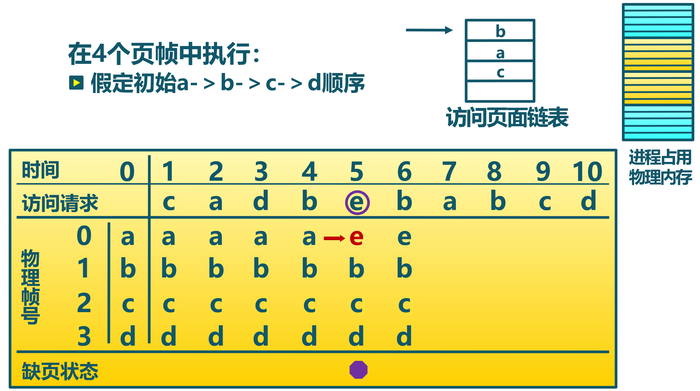
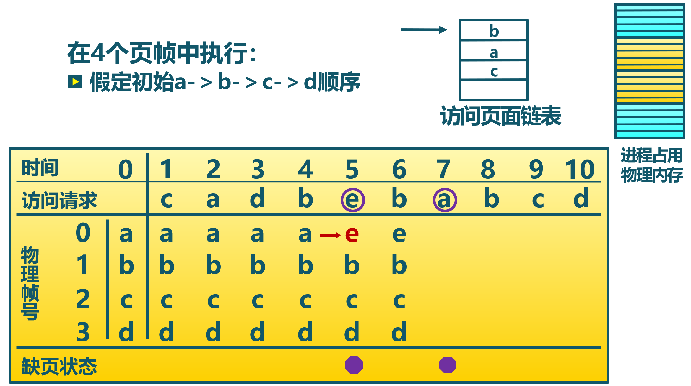
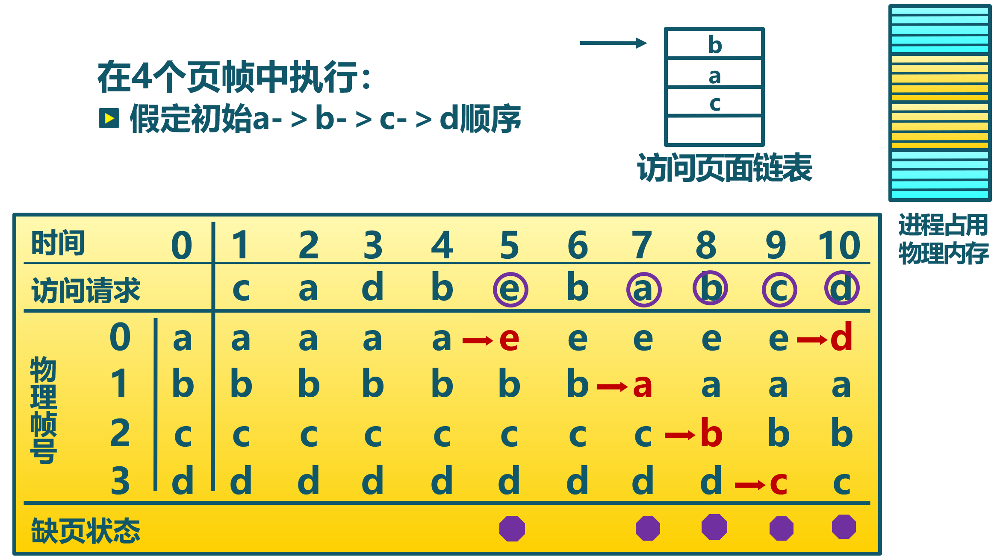

<!-- theme: gaia -->
<!-- _class: lead -->

# Lecture 6 Virtual Memory Management
## Section 2 Local Page Replacement Algorithm


Yong Xiang, Yu Chen, Guoliang Li, Ju Ren

Spring 2023

---

**Outline**

### 1. Basic concept of page replacement algorithm
2. Optimal page replacement algorithm (OPT, optimal)
3. First in first out page replacement algorithm (FIFO)
4. Least recently used page replacement algorithm (LRU, least recently used)
5. Clock page replacement algorithm (Clock)
6. Improved clock page replacement algorithm
7. Least frequently used page replacement algorithm (LFU, least frequently used)
8. Belady phenomenon

---
<style scoped>
{
  font-size: 28px
}
</style>

#### Function and design goals of the page replacement algorithm

- Function
  - When a page fault exception occurs and a new page needs to be brought into memory but memory is full, the page replacement algorithm **selects a physical page to be replaced**

- Design goals
  - Minimize the **number of page faults and swap-in/swap-out times** 
  - Evict pages that are unlikely to be accessed in the future or **have not been accessed for a short period of time**


---
#### Timing of page replacement

- Upper and lower limits of **free memory**
- When reaching the lower limit, start reclaiming memory
- When reaching the upper limit, pause memory reclamation


---

#### Page locking/resident memory

**Logical pages that must be resident in memory**
- Critical parts of the OS
- Code and data that require fast response times
- Locking lock bit in the page table


---
<style scoped>
{
  font-size: 30px
}
</style>

#### Evaluation method for page replacement algorithm

- Evaluation method
  - Record the **trace of memory page access by processes** , simulate the replacement behavior, and record the **number of page faults**
  - **Fewer** page faults lead to ** better** performance
- Example: use (page number, offset) to represent virtual address access
```
(3,0), (1,9), (4,1), (2,1), (5,3), (2,0), (1,9), (2,4), (3 ,1), (4,8)
```
- Corresponding page tracking
```
3, 1, 4, 2, 5, 2, 1, 2, 3, 4 in numbers
c, a, d, b, e, b, a, b, c, d in characters
```

---
<style scoped>
{
  font-size: 32px
}
</style>

#### Classification of page replacement algorithm

- **Local** page replacement algorithm
  - The selection range of the replacement page is limited to the physical page occupied by the **current process**
  - Optimal algorithm, first-in-first-out algorithm, least recently used algorithm
  - Clock algorithm, least frequently used algorithm

- **Global** page replacement algorithm
  - The selection range of the replacement page is **all** swappable physical pages.
  - Working set algorithm, page fault rate algorithm

---
<style scoped>
{
  font-size: 32px
}
</style>

**Outline**

1. Basic concept of page replacement algorithm
### 2. Optimal page replacement algorithm (OPT, optimal)
3. First in first out page replacement algorithm (FIFO)
4. Least recently used page replacement algorithm (LRU, least recently used)
5. Clock page replacement algorithm (Clock)
6. Improved clock page replacement algorithm
7. Least frequently used page replacement algorithm (LFU, least frequently used)
8. Belady phenomenon

---

#### Working principle of optimal page replacement algorithm
- Basic idea
  - Replace the page that will not be accessed for the **longest time** in the future
- Algorithm implementation
  - When a page fault occurs, calculate the **next access time** for each logical page in memory
  - Select the page with the longest future access time for replacement
---
#### Features of optimal page replacement algorithm 
- Mininal page faults is **ideal**
- **Unrealizable** in practical system
- **Unpredictable** waiting time for each page before next visit
  - Run a program on the emulator and record every page visit
  - Use the optimal algorithm in the second run
---

#### Optimal page replacement algorithm example


---

#### Example of optimal page replacement algorithm


---

#### Example of optimal page replacement algorithm


---

#### Example of optimal page replacement algorithm


---
<style scoped>
{
  font-size: 32px
}
</style>

**Outline**

1. Basic concept of page replacement algorithm
2. Optimal page replacement algorithm (OPT, optimal)
### 3. First in first out page replacement algorithm (FIFO)
4. Least recently used page replacement algorithm (LRU, least recently used)
5. Clock page replacement algorithm (Clock)
6. Improved clock page replacement algorithm
7. Least frequently used page replacement algorithm (LFU, least frequently used)
8. Belady phenomenon

---
<style scoped>
{
  font-size: 32px
}
</style>

#### Working principle of FIFO algorithm
- Basic idea
  - Select the page with the longest resident time in memory for replacement
- Algorithm implementation
  - Maintain a linked list that resords all logical pages **residing in memory**
  - The the linked list elements are **sorted by the residence time in memory**, with the longest residence time at the head of the list and the shortest at the tail
  - When a page fault occurs, **select** the page at the head of the list for replacement, and add the new page to the tail of the list

---
#### Features of FIFO algorithm

- Easy to implement
- The performance is poor, and the pages that are frequently accessed may be called out 
- When the number of allocated physical pages increases, the number of page faults may not  necessarily decrease (Belady phenomenon)
- Rarely used alone

---

#### Example of FIFO algorithm


---

#### Example of FIFO algorithm


---

#### Example of FIFO algorithm


---

#### Example of FIFO algorithm



---

#### Example of FIFO algorithm



---

#### Example of FIFO algorithm



---
<style scoped>
{
  font-size: 32px
}
</style>

**Outline**

1. Basic concept of page replacement algorithm
2. Optimal page replacement algorithm (OPT, optimal)
3. First in first out page replacement algorithm (FIFO)
### 4. Least recently used page replacement algorithm (LRU, least recently used)
5. Clock page replacement algorithm (Clock)
6. Improved clock page replacement algorithm
7. Least frequently used page replacement algorithm (LFU, least frequently used)
8. Belady phenomenon

---
<style scoped>
{
  font-size: 28px
}
</style>

#### Working principle of LRU algorithm

- Basic idea
  - Select the page that has not been referenced for the longest time to replacement
  - If a page has not been visited for a long time, it **may not be accessed for a long time in the future**

- Algorithm implementation
  - When there is a page fault, calculate the **last access** time of each logical page in memory
  - Select the page with the longest time since the last access to the current time for replacement
- Algorithm feature
  - **An approximation to the the optimal replacement algorithm**

---

#### Example of LRU algorithm


---

#### Example of LRU algorithm


---

#### Example of LRU algorithm


---

#### Example of LRU algorithm


---

#### Example of LRU algorithm


---

#### Example of LRU algorithm


---

#### Example of LRU algorithm


---
<style scoped>
{
  font-size: 30px
}
</style>

#### Implementation LRU's page linked list 

- Page linked list
  - The system maintains a page **linked list** that is sorted by the lastest access time
    - **The first node of the linked list** is the page that has just been used recently
    - **The tail node of the linked list** is the page that has not been used for the longest time
  - When accessing memory, the corresponding page is found and **moved to the head of the linked list**
  - When there is a page fault, the page at the tail of the list is replaced
- Feature
  - High overhead

---

#### Implementation LRU's page stack

- Activity page **stack**
  - When accessing a page, push its page number **to the top of the stack** , and remove the same page number from the stack
  - When there is a page fault, **replace the page at the bottom of the stack**
- Feature
  - High overhead

---

#### Implementation example of LRU's active page stack 


---

#### Implementation example of LRU's active page stack 


---

#### Implementation example of LRU's active page stack 


---

#### Implementation example of LRU's active page stack 


---

#### Implementation example of LRU's active page stack 


---

#### Implementation example of LRU's active page stack 


---

#### Implementation example of LRU's active page stack 


---

#### Implementation example of LRU's active page stack 


---

#### Implementation example of LRU's active page stack 


---
<style scoped>
{
  font-size: 32px
}
</style>

**Outline**

1. Basic concept of page replacement algorithm
2. Optimal page replacement algorithm (OPT, optimal)
3. First in first out page replacement algorithm (FIFO)
4. Least recently used page replacement algorithm (LRU, least recently used)
### 5. Clock page replacement algorithm (Clock)
6. Improved clock page replacement algorithm
7. Least frequently used page replacement algorithm (LFU, least frequently used)
8. Belady phenomenon

---
<style scoped>
{
  font-size: 30px
}
</style>

#### Working principle of clock replacement algorithm

- Basic idea
  - Only **roughly count** the access status of the page
- Data structure
  - Add an **access bit** to the page table entry to describe the access status of the page in the past period of time
  - Organize all pages into a **circular linked list**
  - The pointer points to **the first loaded page**


---


#### Working principle of clock replacement algorithm

- Algorithm implementation
  - **When accessing the page**, record the page access status in the page table entry
  - **When there is a page fault**, start searching from the pointer for an unaccessed page to replace it


---
<style scoped>
{
  font-size: 27px
}
</style>

#### Implementation of clock replacement algorithm

- When **loading a page into memory**, the access bit is initialized to 0
- When **accessing a page (read/write)**, the access bit is set to 1
- When **a page fault occurs**, the algorithm checks the pages in order from the current position of the pointer
  - When the access bit is 0, the page is replaced
  - When the access bit is 1, the access bit is set to 0, and the pointer moves to the next page until a page that can be replaced is found
- Algorithm feature
  - The clock algorithm is a compromise between LRU and FIFO


---

#### Example of clock replacement algorithm 


---

#### Example of clock replacement algorithm 


---

#### Example of clock replacement algorithm 


---

#### Example of clock replacement algorithm 


---

#### Example of clock replacement algorithm 


---

#### Example of clock replacement algorithm 


---

#### Example of clock replacement algorithm 


---

#### Example of clock replacement algorithm 


---

#### Example of clock replacement algorithm 


---

#### Example of clock replacement algorithm 


---

#### Example of clock replacement algorithm 


---

#### Example of clock replacement algorithm  


---

#### Example of clock replacement algorithm 


---

#### Example of clock replacement algorithm 


---

#### Example of clock replacement algorithm 


---
<style scoped>
{
  font-size: 32px
}
</style>

**Outline**

1. Basic concept of page replacement algorithm
2. Optimal page replacement algorithm (OPT, optimal)
3. First in first out page replacement algorithm (FIFO)
4. Least recently used page replacement algorithm (LRU, least recently used)
5. Clock page replacement algorithm (Clock)
### 6. Improved clock page replacement algorithm
7. Least frequently used page replacement algorithm (LFU, least frequently used)
8. Belady phenomenon


---
<style scoped>
{
  font-size: 30px
}
</style>

####  Working Principle of the Improved Clock Replacement Algorithm

- Basic idea
  - Reduce page fault handling overhead for **modified pages**
- Data structure
  - Add **Modification Bit** to the page to describe the write access of the page in the past period of time
- Algorithm implementation
  - When accessing a page, record the page access status in the page table entry
  - **When modifying the page** , record the page modification  status in the page table entry
  - When there is a page fault, modify the page flag to **skip** the modified page
---

#### Working Principle of the Improved Clock Replacement Algorithm


---

#### Example of Improved Clock Replacement Algorithm 


---

#### Example of Improved Clock Replacement Algorithm 


---

#### Example of Improved Clock Replacement Algorithm 


---

#### Example of Improved Clock Replacement Algorithm


---

#### Example of Improved Clock Replacement Algorithm 


---

#### Example of Improved Clock Replacement Algorithm 


---

#### Example of Improved Clock Replacement Algorithm 


---

#### Example of Improved Clock Replacement Algorithm 


---

#### Example of Improved Clock Replacement Algorithm 


---

#### Example of Improved Clock Replacement Algorithm


---

#### Example of Improved Clock Replacement Algorithm


---

#### Example of Improved Clock Replacement Algorithm


---

#### Example of Improved Clock Replacement Algorithm


---

#### Example of Improved Clock Replacement Algorithm


---
<style scoped>
{
  font-size: 30px
}
</style>

**Outline**

1. The basic concept of page replacement algorithm
2. Optimal page replacement algorithm (OPT, optimal)
3. First in first out page replacement algorithm (FIFO)
4. The least recently used page replacement algorithm (LRU, Least Recently Used)
5. Clock page replacement algorithm (Clock)
6. Improved clock page replacement algorithm
### 7. Least Frequently Used page replacement algorithm (LFU, Least Frequently Used)
8. The Belady phenomenon

---

####  Working Principle of the Least Frequently Used Page Replacement Algorithm  
- Basic idea
  - When there is a page fault , replace the page with the **least visit count**
- Algorithm implementation
  - Set a **visit count** for per page
  - When a page is visited, **increment visit count by 1**
  - When there is a page fault, **replace the page with least visit count**

---

####  Least Frequently Used Page Replacement Algorithm Features

- Features
  - High overhead 
  - Pages that are frequently used at the beginning  but not used later are **difficult to replace**
    - Solution: count shifted right periodically

-LRU focuses on how long the page has not been used, the shorter the time, the better.
-LFU focuses on the number of visits                  , the more the better.

---

#### Example of LFU 

4 physical page frames, the initial number of visits a->8 b->5 c->6 d->2


---

#### Example of LFU 

4 physical page frames, the initial number of visits a->8 b->5 c->6 d->2


---

#### Example of LFU 

4 physical page frames, the initial number of visits a->8 b->5 c->6 d->2


---

#### Example of LFU 

4 physical page frames, the initial number of visits a->8 b->5 c->6 d->2


---

#### Example of LFU 

4 physical page frames, the initial number of visits a->8 b->5 c->6 d->2


---

#### Example of LFU 

4 physical page frames, the initial number of visits a->8 b->5 c->6 d->2


---

#### Example of LFU 

4 physical page frames, the initial number of visits a->8 b->5 c->6 d->2


---
<style scoped>
{
  font-size: 32px
}
</style>

**Outline**

1. The basic concept of page replacement algorithm
2. Optimal page replacement algorithm (OPT, optimal)
3. First in first out page replacement algorithm (FIFO)
4. The least recently used page replacement algorithm (LRU, Least Recently Used)
5. Clock page replacement algorithm (Clock)
6. Improved clock page replacement algorithm
7. Least Frequently Used page replacement algorithm (LFU, Least Frequently Used)
### 8. The Belady Phenomenon

---
<style scoped>
{
  font-size: 30px
}
</style>

#### Belady Phenomenon
- Phenomenon
  - When using algorithms such as FIFO, there may be an abnormal phenomenon that **the number of allocated physical pages increases** and **the number of page faults increases**
- Reason
  - FIFO algorithm's  is **contradictory** to the dynamic feature of the process accessing the memory 
  - The pages replaced by it are **not necessarily** the process will not visit in the near future
- Thinking
  - Which replacement algorithms do not have the Belady phenomenon?

---

#### Belady Phenomenon of FIFO Algorithm

Access sequence: 1, 2, 3, 4, 1, 2, 5, 1, 2, 3, 4, 5
Number of physical pages: 3; Number of page faults: 9


---

#### Belady Phenomenon of FIFO Algorithm

Access sequence: 1, 2, 3, 4, 1, 2, 5, 1, 2, 3, 4, 5
Number of physical pages: 3; Number of page faults: 9


---

#### Belady Phenomenon of FIFO Algorithm

Access sequence: 1, 2, 3, 4, 1, 2, 5, 1, 2, 3, 4, 5
Number of physical pages: 3; Number of page faults: 9


---

#### Belady Phenomenon of FIFO Algorithm

Access sequence: 1, 2, 3, 4, 1, 2, 5, 1, 2, 3, 4, 5
Number of physical pages: 3; Number of page faults: 9


---

#### Belady Phenomenon of FIFO Algorithm

Access sequence: 1, 2, 3, 4, 1, 2, 5, 1, 2, 3, 4, 5
Number of physical pages: 3; Number of page faults: 9


---

#### Belady Phenomenon of FIFO Algorithm

Access sequence: 1, 2, 3, 4, 1, 2, 5, 1, 2, 3, 4, 5
Number of physical pages: 3; Number of page faults: 9


---

#### Belady Phenomenon of FIFO Algorithm

Access sequence: 1, 2, 3, 4, 1, 2, 5, 1, 2, 3, 4, 5
Number of physical pages: 3; Number of page faults: 9


---

#### Belady Phenomenon of FIFO Algorithm

Access sequence: 1, 2, 3, 4, 1, 2, 5, 1, 2, 3, 4, 5
Number of physical pages: 4; Number of page faults: 10


---

#### Belady Phenomenon of FIFO Algorithm

Access sequence: 1, 2, 3, 4, 1, 2, 5, 1, 2, 3, 4, 5
Number of physical pages: 4; Number of page faults: 10


---

#### Belady Phenomenon of FIFO Algorithm

Access sequence: 1, 2, 3, 4, 1, 2, 5, 1, 2, 3, 4, 5
Number of physical pages: 4; Number of page faults: 10


---

#### Belady Phenomenon of FIFO Algorithm

Access sequence: 1, 2, 3, 4, 1, 2, 5, 1, 2, 3, 4, 5
Number of physical pages: 4; Number of page faults: 10


---

#### Belady Phenomenon of FIFO Algorithm

Access sequence: 1, 2, 3, 4, 1, 2, 5, 1, 2, 3, 4, 5
Number of physical pages: 4; Number of page faults: 10


---

#### Belady Phenomenon of FIFO Algorithm


<!--
-->
<!-- -->

---
<style scoped>
{
  font-size: 30px
}
</style>

#### LRU Algorithm does not Experience Belady phenomenon


Does clock/improved clock page replacement experience the Belady phenomenon?
Why does the LRU page replacement algorithm not experience the Belady phenomenon?

---

#### Comparison of LRU, FIFO and Clock

- LRU algorithm and FIFO are essentially based on FIFO ideas
- LRU sorts by the recent access time of the page
- LRU needs to dynamically adjust the sort order
- FIFO sorts by the time the pages entered memory
- FIFO page entry time is fixed

---

#### Comparison of LRU, FIFO and Clock

- LRU can degenerate into FIFO
  - If the page **has not been accessed**after entering the memory , the latest access time is the same as the time when it entered the memory
  - For example: allocate 3 physical pages to the process, the access sequence of logical pages is 1, 2, 3, 4, 5, 6, 1, 2, 3...

---
<style scoped>
{
  font-size: 30px
}
</style>

#### Comparison of LRU, FIFO and Clock

- LRU: high performance,large system overhead 
- FIFO：small system overhead, experience the Belady phenomenon 
- Clock algorithm : their **compromise**
  - When the page is accessed, the order of the page in the linked list is not dynamically adjusted, only marked
  - When there is a page fault, move it to the end of the linked list
  - For **not visited** pages, Clock and LRU algorithms perform as well
  - For **visited** pages, the Clock algorithm cannot record the exact access sequence, while the LRU algorithm can

---

### Summary

1. The basic concept of page replacement algorithm
2. Optimal page replacement algorithm (OPT, optimal)
3. First in first out page replacement algorithm (FIFO)
4. The least recently used page replacement algorithm (LRU, Least Recently Used)
5. Clock page replacement algorithm (Clock)
6. Improved clock page replacement algorithm
7. Least Frequently Used page replacement  algorithm (LFU, Least Frequently Used)
8. The Belady phenomenon


