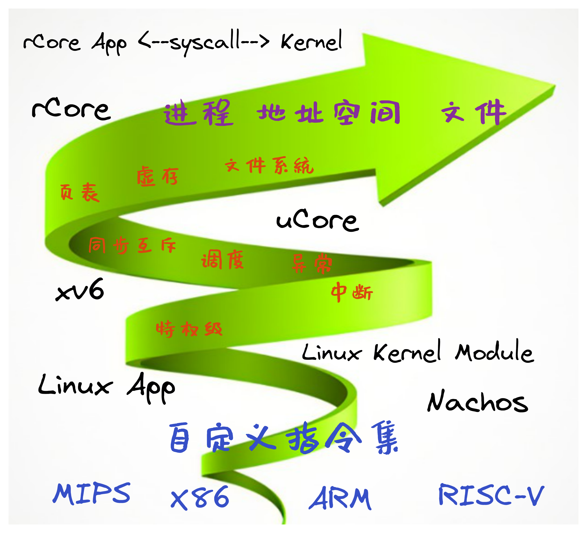

<!-- theme: gaia -->
<!-- _class: lead -->

# 清华大学操作系统课程实验建设与探索

 

陈渝 向勇  李国良 任炬

 

2023年5月12日

 

101计划系统类课程联合研讨会 @ 天津大学 

---
### 报告内容
- 背景介绍
   - 历史
   - 当前基本情况  
- 课程建设
   - 目标+策略
   - 基本思路
   - 具体实施
---
### 背景介绍
清华大学相关院系的操作系统课程

---
### 背景介绍 -- 历史

**铁打的课程，流水的老师**

时间 | 任课老师 | 教材 | 实验 
---------|----------|--------- |----------
 1997前 | 史美林 张尧学 伍尚广 | 计算机操作系统 |  /
 1998 | 向勇 | 无固定教材 |  Nachos MIPS
 2008~2017 | 向勇 陈渝 | 无固定教材 |  uCore x86
 2018~至今 | 向勇 陈渝 李国良 任炬 | 无固定教材 |  uCore/rCore RISC-V

---
### 背景介绍 -- 历史

**铁打的课程，流水的老师**

- 任课老师：李国良(2021)、任炬(2023)
- 相关课程：
   - 大四本科：操作系统专题训练（2008年开始）  
   - 研究生：高级操作系统（2009开始）
   - MOOC：学堂在线（2015年开始）

---
### 背景介绍 -- 当前基本情况

基本情况
- 特征：计算机专业课 必修
- 时间：春季/秋季（48学时）
- 学分：3学分
- 教师：向勇 陈渝 李国良 任炬
- 学生：大三（部分大一/二/四）
- 有实验内容（不算课时）
- 无指定教材/有参考教材

课程目标
- 掌握OS的基本原理和设计思路
- 掌握OS机制的实现技术
- 理解计算机软硬件系统

先修课
- 程序设计+编程语言
- 数据结构+算法
- 计算机组成原理+编译原理

---
### 背景介绍 -- 当前基本情况
学生反馈
- 太难，量太大，不会编程
- 觉得时间投入太大
- 部分同学为了学分而学
- 趣味性不足，缺少及时反馈
- 碰到问题难以及时获得帮助
- 就业并不看好
 

---
### 背景介绍 -- 当前基本情况
参考教材
- **Operating Systems: Three Easy Pieces**, Remzi H. Arpaci-Dusseau and Andrea C. Arpaci-Dusseau
- **Operating system concepts**,Abraham Silberschatz, Peter Baer Galvin,Greg Gagne
- **Operating Systems: Internals and Design Principles**,William Stallings,
- [rCore-Tutorial-Book, 清华OS课程教学组](http://rcore-os.cn/rCore-Tutorial-Book-v3/)
---
### 背景介绍 -- 当前基本情况 -- 教学大纲
特点：粗看：**几十年基本不变**
* 操作系统结构
* 中断及系统调用
* 内存管理
* 进程管理
* 处理机调度
* 同步互斥
* 文件系统

---
### 背景介绍 -- 当前基本情况 -- 教学内容
特点：**基本抽象（骨）大致不变，内容与实验（肉）一直在变化**

**骨** -- 基本抽象：进程、地址空间、文件
**肉** -- 方法技术：调度、页表、文件系统、同步互斥、指令集、配套实验设计...

  
---
### 课程建设的基本思路
- 理解式学习：编写应用，并通过分析应用与OS的执行过程，掌握OS原理
  - 几行~几十行的**应用程序**，理解应用需求
  - 十几个**系统调用**，理解接口
  - OS的系统调用**实现功能**的流程图，理解OS的设计思路
  - **动态调试**应用程序-->系统调用-->操作系统内核的**全系统执行**过程，从而理解操作系统的全局
  
---
### 课程建设的基本思路
- 构造式学习：深入OS内部实现，参考/基于这些OS，扩展某些相对完整的OS功能
  - 几行~几十行的**应用程序**，理解应用需求
  - 十几个**系统调用**，理解接口
  - OS的系统调用**实现功能**的流程图，理解OS的设计思路
  - **动态调试**应用程序-->系统调用-->操作系统内核的**全系统执行**过程，从而理解操作系统的全局
  - 参考已有实现，**扩展/实现**操作系统的新功能/性能优化，从而具备操作系统的设计实现能力，并掌握操作系统

---
### 课程建设的具体实施 -- OS设计

- 原理与实践结合 [原理教学课时：实践教学课时 = 2：1]
    - 提供十几个由简单到相对复杂功能进化的OS实例
    - 提供OS的详细设计实现文档、多种测试用例、自动测试环境
   -  课程上讲的OS原理和概念在实践或实验中基本上有对应
   -  分析原理和实践有共同点和差异点
   -  通过原理和实践来深化对操作系统全局与细节的理解

---
### 1. 裸机程序：LibOS             
  - 软硬件启动，栈的建立、函数调用，SBI调用

- 理解RISC-V的特权模式，理解SBI访问，编写裸机程序

---
### 2. Batch OS  
  - 特权级: U-Mode, S-Mode
  - 特权级切换
  - 陷入上下文
  - 编译多应用+OS的镜像
  - 加载并执行应用

---
### 3. MultiProg OS  
   - 任务的概念
   - 任务的设计实现
   - 协作/抢占式调度
   -  任务上下文 
   -  陷入上下文
   - 切换任务
   - 切换特权级
 

--- 
### 4. TimeSharing OS  
   - 中断
   - 中断响应
   - 协作/抢占式调度
   -  陷入上下文
   -  任务上下文 
   - 切换任务
   - 切换特权级
 

---
### 5. AddrSpace OS  
- APP的地址空间布局
- 地址空间
- 物理地址
- 页表
-  陷入上下文
-  任务上下文 
-  中断响应

 

---
### 5. AddrSpace OS  
- 应用地址空间
- 内核地址空间
- 切换任务
- 切换特权级
- 切换页表
  

---
### 6. Process OS  
  - 进程的动态概念

  - 四个进程相关的系统调用
    - fork, exec, exit, wait
 

---
### 6. Process OS   
   - PCB 

---
### 7. Filesystem OS  
- 文件系统在操作系统中的位置
- 进程的文件描述符表
- 文件相关系统调用

---
### 8. IPC OS
支持进程间通信和异步消息机制
- 管道（PIPE）
- 信号（Signal）

---
### 8. IPC OS
对进程控制块的扩展
- 管道也是一种文件
- 支持I/O重定向

---
### 9. Thread OS
- 用户态管理的用户态运行的线程
- 内核态管理的用户态运行的线程

---
### 9. Thread OS
- 协程结构
- 线程结构
- 进程结构

---
### 10. SyncMutex OS
对进程控制块扩展，支持线程同步互斥访问共享变量
- Mutex
- Semphore
- Condvar

---
### 10. SyncMutex OS
对进程控制块扩展，支持线程同步互斥访问共享变量
- Mutex
- Semphore
- Condvar

---
### 11. Device OS
支持块设备/串口等外设
- 内核态中断响应
- DMA
- 轮询
- 设备<-->内存间数据传输
- 同步互斥保护

---
### 必做实验 1 ：获取任务信息

- 预先学习 1-4的OS源码

#### 实验要求内容

我们的系统已经能够支持多个任务分时轮流运行，我们希望引入一个新的系统调用 sys_task_info 以获取当前任务的信息

---
### 必做实验 2 ：完成mmap和munmap系统调用功能

- 预先学习 1-5的OS源码

#### 实验要求内容

- 引入虚存机制后，原来内核的 sys_get_time 和 sys_task_info 函数实现就无效了。请你重写这个函数，恢复其正常功能。
- mmap 在 Linux 中主要用于在内存中映射文件， 本次实验简化它的功能，仅用于申请内存。请实现 mmap 和 munmap 系统调用

---
### 必做实验 3 ：完成spawn系统调用功能

- 预先学习 1-6的OS源码

#### 实验要求内容

实现一个完全 DIY 的系统调用 spawn，用以创建一个新进程。

---
### 必做实验 4 ：实现文件的硬链接功能

- 预先学习 1-7的OS源码

#### 实验要求内容

硬链接要求两个不同的目录项指向同一个文件，在我们的文件系统中也就是两个不同名称目录项指向同一个磁盘块。要求实现三个系统调用 sys_linkat、sys_unlinkat、sys_stat 。

---
### 必做实验 5 ：同步与互斥

- 预先学习 1-10的OS源码

#### 实验要求内容

完成对基于信号量/条件变量的同步互斥多线程程序的死锁检测

---
### 成绩评定

#### 选择1：（总分不超过100分）
- 必做实验1-5占35%，期中考试15%，期末考试50%
- 加分项：完成拓展实验（可只做一题），加0~7分，避免内卷
- 期中和期末考试内容，大约40%出自课堂介绍的OS实践

#### 选择2：
- 五周内完成必做实验1-5：35%
- 课程设计（即大实验）：65% （中途退出必须参加考试）

---
### 拓展实验（加分项）

#### 基于Address OS实现
- 惰性页面分配（Lazy page allocation）（4分）
- 局部页面置换算法：改进的Clock页面置换算法（4分）
- 全局页面置换算法：工作集置换策略（5分）
- 全局页面置换算法：缺页率置换策略（5分）

---
### 拓展实验（加分项）
 
#### 基于Process OS实现
- 相同页面共享（Same page sharing）fork时的Copy on Write（6分）
- 实现多种(>3种)调度算法：可动态提升/降低优先级的多级反馈队列、实时调度等（4分）
- 多核支持与多核调度（支持进程迁移和多核模式执行应用程序，但在内核中没有抢占和多核支持）（7分）

---
### 拓展实验（加分项）
 
#### 基于FileSystem OS实现
- 按需加载执行文件(Demanding Paging)（6分）
- log-easyfs：实现基于日志的可靠文件系统（可参考xv6-fs）（7分）

---
### 拓展实验（加分项）

#### 基于SyncMutex OS实现
- 基于多核的OS内核线程支持，内核支持抢占，支持多核方式下的同步互斥（7分）
- 提升多核的OS内核性能，实现内核中的并行性能优化（fs中的缓冲区管理并行化, 物理内存分配的并行化）（7分）
- 更通用的内核+应用的死锁检查（参考Linux）（7分）

---
### 课程设计（大实验）

- 基于uCore/rCore的功能模块扩展
- 基于模块化操作系统ArceOS的功能拓展
- 全国大学生系统能力大赛（OS内核与功能赛道）赛题
- 任课老师的研究课题
- ···

#### 选择大实验的学生比例大约在10%，愿意在研究生阶段从事OS相关研究的学生一般选择大实验

---
###  课程建设的具体实施 -- 课程资源建设
#### 课程实践内容 -- rCore Tutorial Book v3
-  [课程实践参考书](https://learningos.github.io/rCore-Tutorial-Book-v3/)，[课程实践代码](https://github.com/rcore-os/rCore-Tutorial-v3)，[课程实践代码的API文档](https://learningos.github.io/rCore-Tutorial-v3/)

#### 课程实验内容 -- rCore Tutorial Guide 2022 Spring
- [实验文档](https://github.com/LearningOS/rCore-Tutorial-Guide-2022S/)  , [API文档](https://github.com/LearningOS/rCore-Tutorial-Guide-2022S/) , [实验代码](https://github.com/LearningOS/rCore-Tutorial-Code-2022S)，[测试用例](https://github.com/LearningOS/rCore-Tutorial-Test-2022S) 

#### 课程参考文档 --教材/课件
- [课程在线Slides](http://learningos.github.io/os-lectures/)，[Operating Systems: Three Easy Pieces](https://pages.cs.wisc.edu/~remzi/OSTEP/)
- [深入了解计算机系统](https://hansimov.gitbook.io/csapp/)，[RISC-V Reader中文版](http://riscvbook.com/chinese/RISC-V-Reader-Chinese-v2p1.pdf)

---
<!-- theme: gaia -->
<!-- _class: lead -->

# 谢谢！

开源操作系统训练营

https://github.com/LearningOS/rust-based-os-comp2023 

一年三期：春季学期、秋季学期、暑假

---
<!-- theme: gaia -->
<!-- _class: lead -->

# 备份材料
- 十三讲的课程内容设计+知识点设计

---
#### 第一讲 操作系统概述

- [第一节 课程概述 & 教学安排](../lec1/p1-intro.html)
- [第二节 什么是操作系统](../lec1/p2-whatisos.html)
- [第三节 操作系统历史演化](../lec1/p3-oshistory.html)
- [第四节 操作系统结构](../lec1/p4-osarchitecture.html)
- [第五节 实践：试试UNIX/Linux](../lec1/p5-tryunix.html)

知识点
- 操作系统定义、抽象、特征
- 操作系统历史演化
- 操作系统的架构
- 硬件与操作系统的关系与接口
- 应用与操作系统的关系与接口
- 实践：Linux/rCore/uCore APP

---
#### 第二讲 实践与实验介绍

- [第一节 实践与实验简要分析](../lec2/p1-labintro.html)
- [第二节 Compiler与OS](../lec2/p2-compiling.html)
- [第三节 硬件启动与软件启动](../lec2/p3-boot.html)
- [第四节 实践：裸机程序 -- LibOS](../lec2/p4-lab1.html)

知识点
- 函数调用、栈帧与参数
- 编译器/硬件与OS的共识
- 加电后硬件/软件启动过程
- 程序执行过程、Linux应用编程
- RISC-V的SBI
- 开发环境与执行环境、裸机编程
- 实践：LibOS操作系统

---
#### 第三讲 基于特权级的隔离与批处理

- [第一节 从 OS 角度看计算机系统](../lec3/p1-osviewarch.html)
- [第二节 从 OS 角度看RISC-V](../lec3/p2-osviewrv.html)
- [第三节 实践：批处理操作系统](../lec3/p3-batchos.html)

知识点
- 特权级与特权级切换
- 系统调用、外设中断、软件异常
- 系统调用设计与实现、执行过程
- 实践：批处理操作系统

---

#### 第四讲 多道程序与分时多任务

- [第一节 相关背景与基本概念](../lec4/p1-multiprog.html)
- [第二节 实践：多道程序与分时多任务操作系统](../lec4/p2-labs.html)

知识点
- 上下文、中断、任务、任务/中断上下文、任务/中断上下文切换、任务/中断上下文切换的时机
- 任务生命周期、任务执行过程
- 协作式调度、抢占式调度
- 实践：多道程序操作系统
- 实践：分时多任务操作系统

---

#### 第五讲 地址空间-物理内存管理

- [第一节 地址空间](../lec5/p1-memintro.html)
- [第二节 内存分配](../lec5/p2-memalloc.html)
- [第三节 实践：建立地址空间的操作系统](../lec5/p3-labs.html)

知识点

- 地址空间、内存管理、连续物理内存分配、非连续物理内存分配
- 物理内存的管理
- 多级页表的设计与实现
- 访存异常及其软硬件协同处理过程
- 实践：基于地址空间的分时多任务操作系统

---
#### 第六讲  地址空间-虚拟存储管理

- [第一节  虚拟存储的基本概念](../lec6/p1-vmoverview.html)
- [第二节 页面置换算法 -- 局部页面置换算法](../lec6/p2-pagereplace-1.html)
- [第三节 页面置换算法 -- 全局页面置换算法](../lec6/p2-pagereplace-2.html)

知识点
- 局部性原理、虚拟存储基本概念、Page Fault异常、局部页面置换算法、全局页面置换算法、Belady异常
- 按需分页、Copy On Write、基于页的内存换入换出机制
- 实践：支持虚存的分时多任务操作系统

---
#### 第七讲  进程管理与单处理器调度

- [第一节 进程管理](../lec7/p1-process-overview.html)
- [第二节 单处理器调度](../lec7/p2-sched.html)
- [第三节 实时管理与调度](../lec7/p3-realtime.html)
- [第四节 实践：支持进程的操作系统](../lec7/p4-labs.html)

知识点
- 进程概念、进程运行状态、进程的管理、基本调度策略/算法
- 实时任务、实时调度算法、优先级反置问题与解决方法
- 进程控制块和fork, exec, waitpid, exit系统调用的设计与执行
- 实践：支持进程的操作系统

---
#### 第八讲  多处理器调度

- [第一节 对称多处理与多核架构](../lec8/p1-multiprocessor-overview.html)
- [第二节 多处理器调度概述](../lec8/p2-multiprocessor-sched-overview.html)
- [第三节 Linux O(1) 调度](../lec8/p3-linux-O1-sched.html)
- [第四节 Linux CFS（Completely Fair Schduler） 调度](../lec8/p4-linux-cfs-sched.html)
- [第五节 Linux/FreeBSD BFS 调度](../lec8/p5-linux-bfs-sched.html)

知识点
- 多核/SMP/NUMA架构的特征
- 多处理器调度算法
- 负载迁移技术

---
#### 第九讲  文件系统

- [第一节 文件系统概述](../lec9/p1-fsoverview.html)
- [第二节 文件系统的设计与实现](../lec9/p2-fsimplement.html)
- [第三节 支持崩溃一致性的文件系统](../lec9/p3-fsjournal.html)
- [第四节 支持文件的操作系统](../lec9/p4-fs-lab.html)

知识点
- 文件系统基本概念：文件/目录/文件描述符/目录项, 软/硬链接
- 文件/文件系统设计与实现
- open/close/read/write系统调用的设计与执行
- 链式/索引文件结构设计、空闲磁盘块空间管理、缓冲区管理
- 实践：支持文件的FS操作系统

---
#### 第十讲  进程间通信

- [第一节 进程间通信(IPC)概述](../lec10/p1-ipcoverview.html)
- [第二节 支持IPC的OS](../lec10/p2-ipclabs.html)

知识点
- 无名/有名管道、消息队列、共享内存、信号的应用编程与设计实现
- 支持管道与信号的IPC操作系统

---
#### 第十一讲  线程与协程

- [第一节 线程](../lec11/p1-thread.html)
- [第二节 协程](../lec11/p2-coroutine.html)
- [第三节 支持线程/协程的OS(TCOS)](../lec11/p3-labs.html)

知识点
- 线程、协程的起因与特征
- 用户态管理的线程设计与实现
- 内核态管理的线程设计与实现
- 实践：支持线程的操作系统

---
#### 第十二讲 同步互斥

- [第一节 概述](../lec12/p1-syncmutex.html)
- [第二节 信号量](../lec12/p2-semaphore.html)
- [第三节 管程与条件变量](../lec12/p3-monitor-cond.html)
- [第四节 同步互斥实例问题](../lec12/p4-instances.html)
- [第五节 死锁](../lec12/p5-deadlock.html)
- [第六节 支持同步互斥的OS(SMOS)](../lec12/p6-labs.html)

知识点
- 软件实现的互斥、基于中断的互斥、基于原子指令的互斥
- 忙等方式与休眠方式的同步互斥
- 信号量的设计与实现
- 管程与条件变量的设计与实现
- 死锁必要条件、死锁安全、银行家算法、死锁检测算法等
- 实践：支持同步互斥的操作系统

---
#### 第十三讲 设备管理

- [第一节 设备接口](../lec13/p1-devinterface.html)
- [第二节 磁盘子系统](../lec13/p2-disk.html)
- [第三节 第三节 支持device的OS（DOS）](../lec13/p3-Labs.html)

知识点
- I/O设备分类、I/O传输方式、I/O设备抽象
- I/O执行模型
- 串口驱动、块设备驱动
- 内核态响应中断
- 实践：支持外设中断的操作系统

